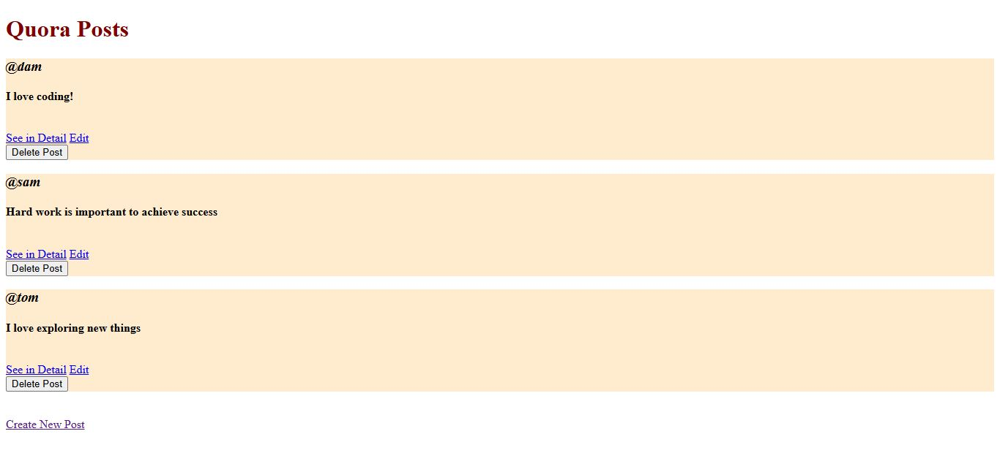
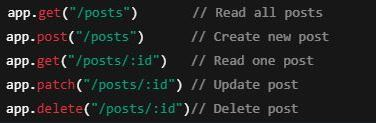

# 🧩 REST API CRUD App (Express + EJS)

A full-stack CRUD (Create, Read, Update, Delete) app built using **Node.js**, **Express**, and **EJS** — to understand REST APIs and backend fundamentals in action.

---

## 🚀 Project Overview
This project demonstrates how RESTful APIs work in real web apps.  
It’s a small **Quora-like posts app**, where you can:
- ✍️ Create new posts  
- 👀 View all posts  
- 🛠️ Edit existing posts  
- ❌ Delete posts  

Each operation follows REST conventions using different HTTP methods — `GET`, `POST`, `PATCH`, and `DELETE`.

---

## 🧱 Tech Stack

| Layer | Technology |
|-------|-------------|
| Backend | Node.js, Express.js |
| Views | EJS Templates |
| Styling | CSS |
| Utilities | UUID, Method-Override |

---

## 📂 Folder Structure

rest-api-express-crud/
│
├── public/
│ └── style.css
│
├── views/
│ ├── index.ejs # Display all posts
│ ├── new.ejs # Form to create a new post
│ ├── show.ejs # Show post details
│ └── edit.ejs # Edit post form
│
├── index.js # Main Express app
├── package.json
└── README.md


---

## ⚙️ How It Works

**1️⃣ Read All Posts**  
`GET /posts` → Displays all existing posts.  

**2️⃣ Create New Post**  
`POST /posts` → Adds a new post with username & content.  

**3️⃣ Edit Post**  
`PATCH /posts/:id` → Updates post content.  

**4️⃣ Delete Post**  
`DELETE /posts/:id` → Removes a post.  

To support PATCH & DELETE in HTML forms, the project uses:
```js
const methodOverride = require("method-override");
app.use(methodOverride("_method"));
```

## 🧠 What I Learned

- REST architecture and HTTP methods

- Handling routes and dynamic URLs in Express

- Using EJS for server-rendered views

- Handling form submissions in backend

- Implementing method-override to extend HTML form functionality

## 🖼️ Screenshots




## 🏃 How to Run Locally

# Clone the repository
git clone https://github.com/CodeByAlmas/rest-api-express-crud.git
cd rest-api-express-crud

# Install dependencies
npm install

# Start the server
node index.js

Then open 👉 http://localhost:8080/posts

## 💬 Connect With Me

👨‍💻 [**Mohd Almas**](https://github.com/CodeByAlmas)
🔗 [**LinkedIn**](https://www.linkedin.com/in/mohd-almas-9ab9a6235/)
📧 Email: mohd2almas321@gmail.com

⭐ If you found this helpful, don’t forget to star the repo — it motivates me to keep learning and building more projects!